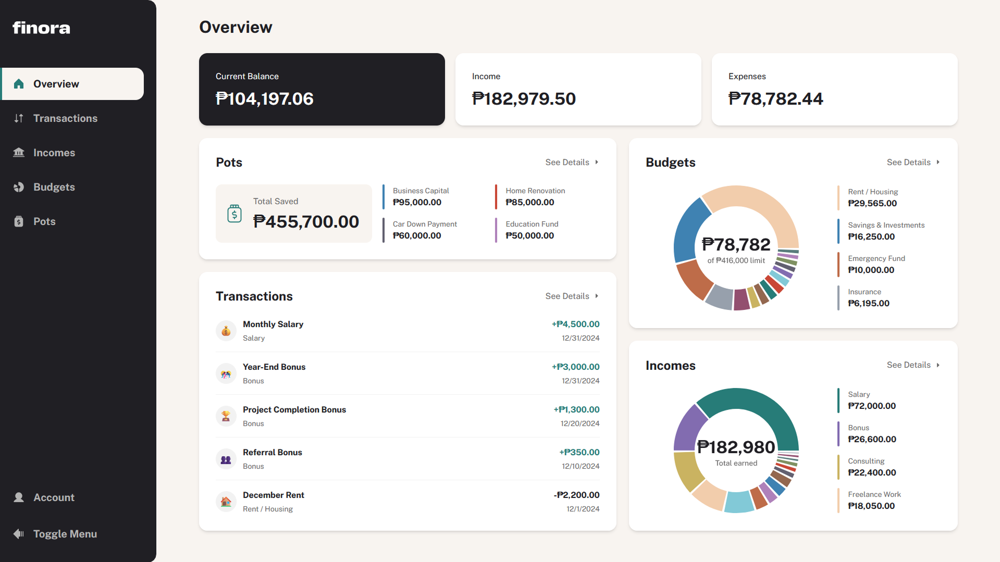

# 💰 Finora - Personal Finance Management

Welcome to **Finora**! A comprehensive personal finance management tool that helps you track your income and expenses, set budgets, and save for your future. Take control of your financial life with intuitive insights and powerful management features.

🌐 **Live Demo**: [finora-official.vercel.app](https://finora-official.vercel.app)



---

## ✨ Features

- 🔐 **Authentication & Authorization**
  - Email/Password authentication
  - Google Sign-In integration
  - Email verification
  - Password reset functionality
  - Secure session management

- 📊 **Dashboard Overview**
  - Comprehensive financial overview
  - Visual charts and analytics
  - Real-time balance tracking
  - Spending insights

- 💳 **Transaction Management**
  - Add, edit, and delete transactions
  - Categorize expenses and income
  - Advanced filtering and search
  - Recurring transactions support

- 💰 **Budget Tracking**
  - Create custom budgets by category
  - Track spending against budget limits
  - Visual budget progress indicators
  - Budget utilization alerts

- 📈 **Income Management**
  - Track multiple income sources
  - Recurring income support
  - Income categorization
  - Income history and trends

- 🏺 **Savings Pots**
  - Create savings goals
  - Track progress toward goals
  - Add/withdraw from pots
  - Visual savings progress

- 👤 **Account Management**
  - User profile customization
  - Account settings
  - Data management

---

## 🛠️ Tech Stack

### **Frontend**

- ⚡ **[Next.js 15.5.3](https://nextjs.org/)** - React framework with App Router
- ⚛️ **[React 19.1.0](https://react.dev/)** - UI library
- 🎨 **[TailwindCSS 4](https://tailwindcss.com/)** - Utility-first CSS framework
- 🧩 **[Radix UI](https://www.radix-ui.com/)** - Unstyled, accessible components
- 📊 **[Recharts](https://recharts.org/)** - Composable charting library
- 🎭 **[Phosphor Icons](https://phosphoricons.com/)** - Flexible icon library

### **Backend & Database**

- 🔥 **[Firebase](https://firebase.google.com/)** - Backend-as-a-Service
- 🗄️ **[Firestore](https://firebase.google.com/docs/firestore)** - NoSQL cloud database
- 🔐 **[Firebase Authentication](https://firebase.google.com/docs/auth)** - User authentication
- 🔒 **[next-firebase-auth-edge](https://next-firebase-auth-edge.vercel.app/)** - Edge-compatible auth

### **API & Data Fetching**

- 🔌 **[tRPC](https://trpc.io/)** - End-to-end typesafe APIs
- 🔄 **[TanStack Query](https://tanstack.com/query)** - Powerful data synchronization
- 📦 **[SuperJSON](https://github.com/blitz-js/superjson)** - JSON serialization

### **Form Management & Validation**

- 📝 **[React Hook Form](https://react-hook-form.com/)** - Performant forms
- ✅ **[Zod](https://zod.dev/)** - TypeScript-first schema validation

### **Development Tools**

- 🔷 **[TypeScript 5](https://www.typescriptlang.org/)** - Type safety
- 🧪 **[Vitest](https://vitest.dev/)** - Unit testing framework
- 🎭 **[Playwright](https://playwright.dev/)** - End-to-end testing
- 📖 **[Storybook](https://storybook.js.org/)** - Component development
- 🎨 **[ESLint](https://eslint.org/)** & **[Prettier](https://prettier.io/)** - Code quality
- 🐶 **[Husky](https://typicode.github.io/husky/)** - Git hooks

---

## 🚀 Getting Started

### Prerequisites

Make sure you have the following installed on your machine:

- **[Node.js](https://nodejs.org/)** version 20.0.0 or higher
- **npm** (comes with Node.js)

### Installation

1. **Clone the repository**

```bash
git clone https://github.com/CarlosSimon02/finora.git
cd finora
```

2. **Install dependencies**

```bash
npm install
```

3. **Set up environment variables**

Create a `.env.local` file in the root directory and add your environment variables. Use the `.env.example` file as a reference:

```bash
cp .env.example .env.local
```

Then, fill in your Firebase configuration and other required variables:

```bash
##############################
# 🔥 FIREBASE CONFIGURATION
##############################

FIREBASE_CLIENT_EMAIL="your-firebase-client-email"
FIREBASE_PRIVATE_KEY="your-firebase-private-key"

##############################
# 🔥 CLIENT-SIDE FIREBASE CONFIGURATION
##############################

NEXT_PUBLIC_FIREBASE_API_KEY="your-firebase-api-key"
NEXT_PUBLIC_FIREBASE_AUTH_DOMAIN="your-firebase-auth-domain"
NEXT_PUBLIC_FIREBASE_MESSAGING_SENDER_ID="your-messaging-sender-id"
NEXT_PUBLIC_FIREBASE_APP_ID="your-firebase-app-id"
NEXT_PUBLIC_FIREBASE_PROJECT_ID="your-firebase-project-id"
NEXT_PUBLIC_FIREBASE_STORAGE_BUCKET="your-firebase-storage-bucket"

##############################
# ⚡ CLIENT-SIDE EMULATOR SETTINGS (For Local Development)
##############################

NEXT_PUBLIC_IS_USING_EMULATORS="false"  # Set to true if using Firebase emulators
NEXT_PUBLIC_EMULATOR_HOST="localhost"
NEXT_PUBLIC_FIRESTORE_EMULATOR_PORT="8080"
NEXT_PUBLIC_STORAGE_EMULATOR_PORT="9199"
NEXT_PUBLIC_FUNCTIONS_EMULATOR_PORT="5001"
NEXT_PUBLIC_AUTH_EMULATOR_HOST="localhost:9199"

##############################
# 🌯 Next Firebase Auth Edge Configuration
##############################

USE_SECURE_COOKIES=false
COOKIE_SECRET_CURRENT="your-secret-current"
COOKIE_SECRET_PREVIOUS="your-secret-previous"

##############################
# 🌐 General App Configuration
##############################

NEXT_PUBLIC_SITE_URL=http://localhost:3000
```

> **Note**: To get your Firebase credentials, create a project in the [Firebase Console](https://console.firebase.google.com/) and enable Authentication and Firestore.

4. **Run the development server**

```bash
npm run dev
```

5. **Open your browser**

Navigate to [http://localhost:3000](http://localhost:3000) to see the app in action! 🎉

---

## 🧞 Commands

All commands are run from the root of the project:

| Command                      | Action                                       |
| :--------------------------- | :------------------------------------------- |
| `npm install`                | Installs dependencies                        |
| `npm run dev`                | Starts local dev server at `localhost:3000`  |
| `npm run build`              | Build your production site to `./.next/`     |
| `npm run start`              | Preview your build locally, before deploying |
| `npm run lint`               | Run ESLint to check code quality             |
| `npm test`                   | Run unit tests with Vitest                   |
| `npm run test:watch`         | Run tests in watch mode                      |
| `npm run test:ci`            | Run tests with coverage report               |
| `npm run test:ui`            | Run tests with UI                            |
| `npm run storybook`          | Start Storybook on `localhost:6006`          |
| `npm run build-storybook`    | Build Storybook for production               |
| `npm run playwright:install` | Install Playwright browsers for E2E testing  |

---

## 📁 Project Structure

```
finora/
├── src/
│   ├── app/                  # Next.js App Router pages
│   │   ├── (auth)/          # Authentication pages
│   │   └── (front)/         # Main app pages
│   ├── core/                # Business logic & use cases
│   ├── data/                # Data layer & repositories
│   ├── presentation/        # UI components & views
│   ├── lib/                 # Utility libraries
│   ├── config/              # Configuration files
│   └── types/               # TypeScript type definitions
├── public/                  # Static assets
└── ...config files
```

---

## 🧪 Testing

### Unit Tests

```bash
npm test
```

### Component Development

```bash
npm run storybook
```

---

## 🚢 Deployment

The app is deployed on [Vercel](https://vercel.com). Visit the live site at [finora-official.vercel.app](https://finora-official.vercel.app).

To deploy your own instance:

1. Push your code to GitHub
2. Import your repository to [Vercel](https://vercel.com)
3. Add your environment variables in Vercel project settings
4. Deploy! 🚀

---

## 🤝 Contributing

Contributions are welcome! Please feel free to submit a Pull Request.

---

## 📄 License

This project is open source and available under the [MIT License](LICENSE).

---

## 👨‍💻 Developer

Built with ❤️ by [Carlos Simon](https://github.com/CarlosSimon02)

---

## 🙏 Acknowledgments

- [Frontend Mentor](https://www.frontendmentor.io/)

---

**Made with 💙 and ☕**
